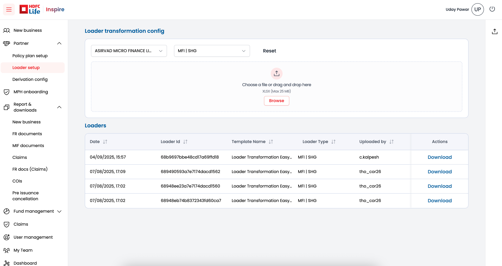
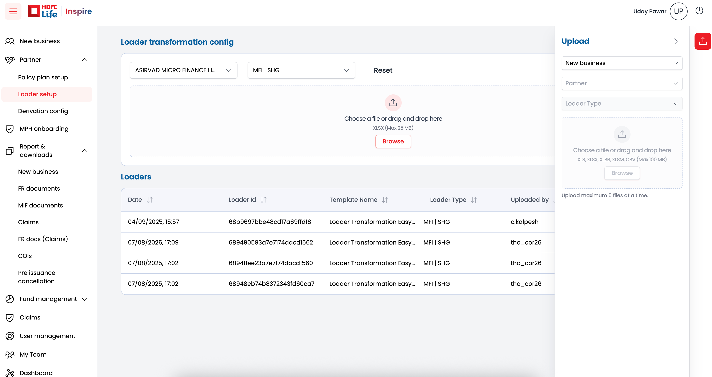
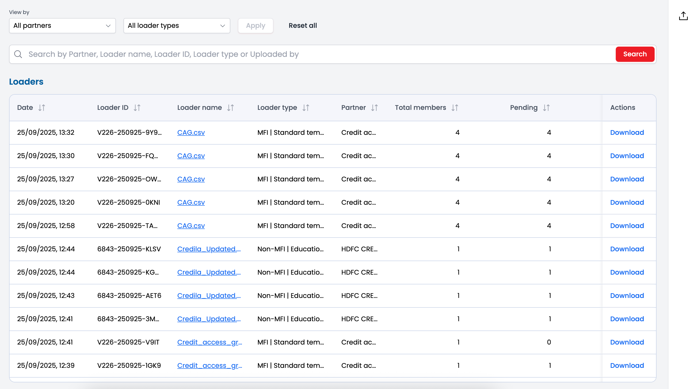
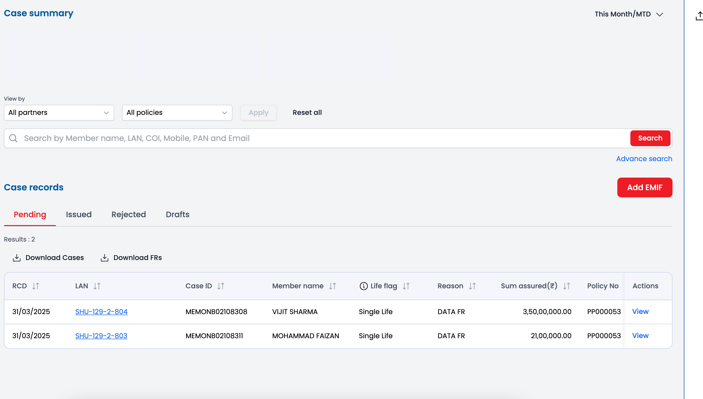

This is a [Next.js](https://nextjs.org) project bootstrapped with [`create-next-app`](https://github.com/vercel/next.js/tree/canary/packages/create-next-app).

## Getting Started

First, run the development server:

```bash
npm run dev
# or
yarn dev
# or
pnpm dev
# or
bun dev
```

Open [http://localhost:3000](http://localhost:3000) with your browser to see the result.

You can start editing the page by modifying `app/page.js`. The page auto-updates as you edit the file.

This project uses [`next/font`](https://nextjs.org/docs/app/building-your-application/optimizing/fonts) to automatically optimize and load [Geist](https://vercel.com/font), a new font family for Vercel.

## Learn More

To learn more about Next.js, take a look at the following resources:

- [Next.js Documentation](https://nextjs.org/docs) - learn about Next.js features and API.
- [Learn Next.js](https://nextjs.org/learn) - an interactive Next.js tutorial.

You can check out [the Next.js GitHub repository](https://github.com/vercel/next.js) - your feedback and contributions are welcome!

## Deploy on Vercel

The easiest way to deploy your Next.js app is to use the [Vercel Platform](https://vercel.com/new?utm_medium=default-template&filter=next.js&utm_source=create-next-app&utm_campaign=create-next-app-readme) from the creators of Next.js.

Check out our [Next.js deployment documentation](https://nextjs.org/docs/app/building-your-application/deploying) for more details.


Links:
1. Figma Design :- https://www.figma.com/design/MrOg6UkDpCCdbrEbxp1RDs/Member-Onboarding?node-id=0-1&p=f
2. One-x-ui :- https://helix.apps-hdfclife.com/

Password: 
User: digiqt-1
Password:  Hdfclife@2025

Screenshots:
1. 
2. 
3. 
4. 


files and folder to be deleted
1. src/app/not-found.tsx
2. 

folder naming
1. for grouping => (folder_name)
2. for dynamic routing => [folder_name]


file naming
1. for not found page => not-found.tsx

2.


// Get Partners
    request:- https://localhost:8080/api/partners/name
    method:- GET
    response:- {
        "success": true,
        "partners": [
            { "id" : 1, "name": "Partner 1" },
            {"id" : 2, "name": "Partner 2" }
        ]
    }
    
// Get config
    requets:- https://api.example.com/partners {body: partnerId}
   

 


// Axios GET request
 const response = axios.get(url, {
    baseURL: '',
    params: {key: value},
    headers: {},
    timeout: 10000,
    responseType: 'json',
 })


 response = {
    data:<any> The response body (usually JSON),
    status:<number> HTTP status code (e.g. 200, 404),
    statusText:<string> HTTP status text (e.g. "OK", "Not Found"),
    headers:<object> Response headers,
    config:<object> The original Axios request config
    request:<object> The actual request object (browser XMLHttpRequest) or Node.js request
 }


 // Axios POST request
    axios.post(url, data, config)
        url => API endpoint
        data => the payload you want to send in the request body
        config => optional config object (headers, timeout, etc.)
    // example
        axios.post('https://api.example.com/create', 
        { name: 'John', age: 30 },
        {
            headers: {
            'Authorization': 'Bearer YOUR_TOKEN',
            'Content-Type': 'application/json'
            },
            timeout: 7000
        }
    )
.then(res => console.log(res.data))
.catch(err => console.error(err));
